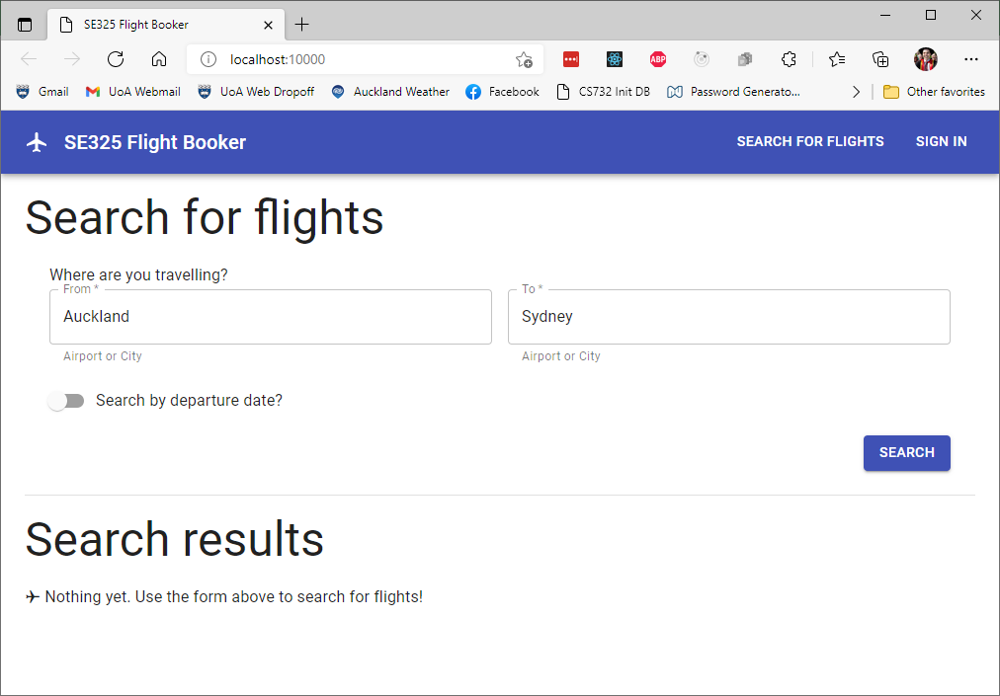
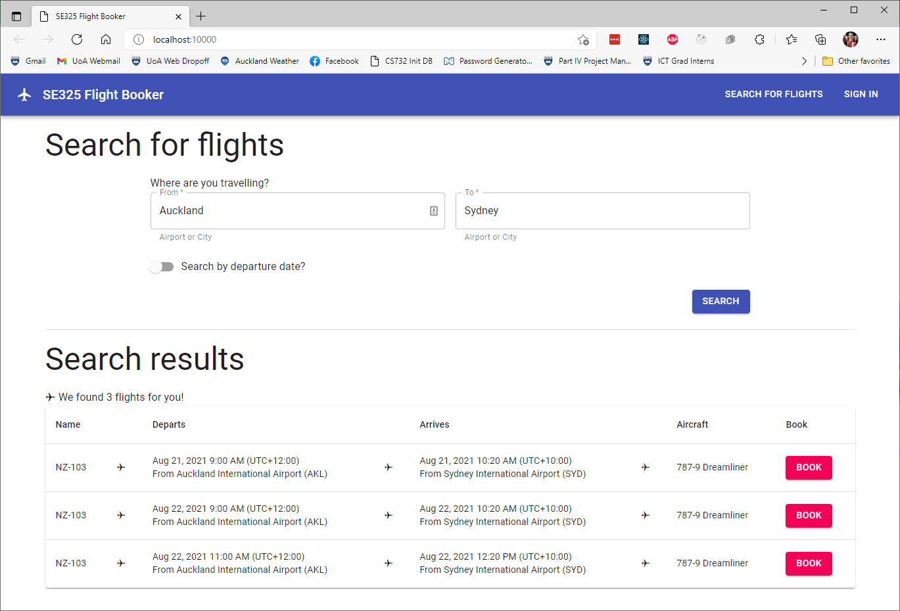
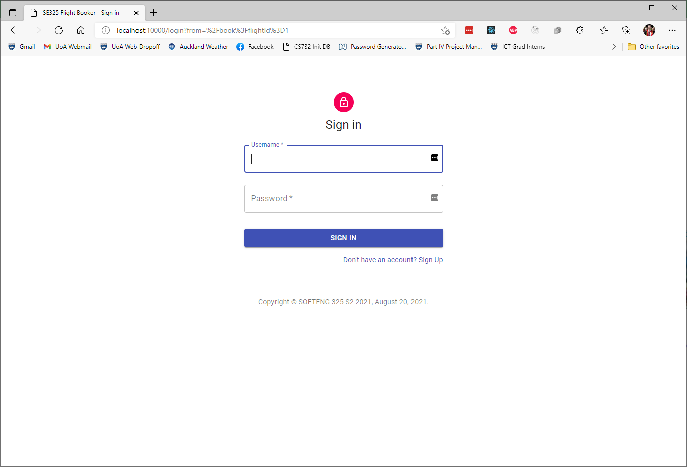
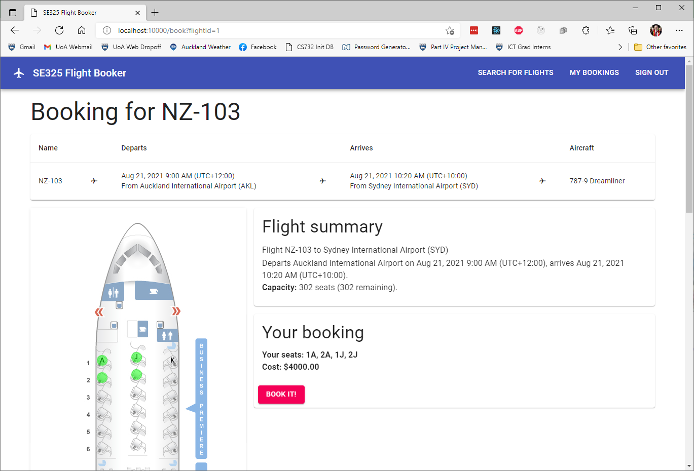
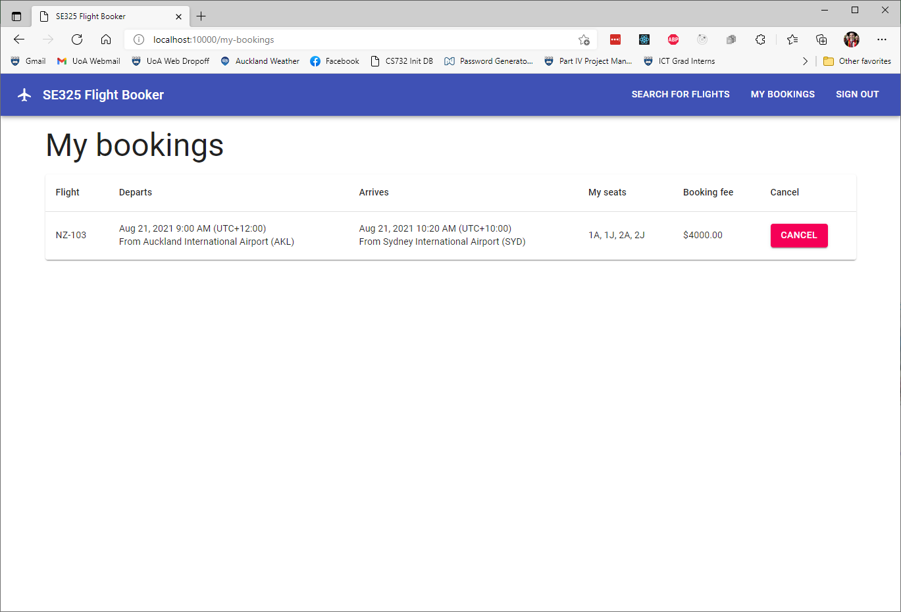
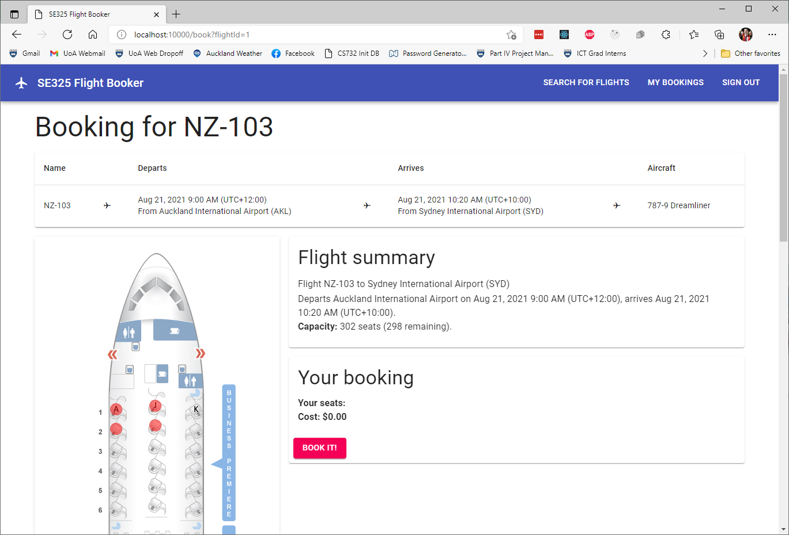

### Project: Flight Management System

A booking service is required for a website which aggregates flights from several airlines, and airports, on several different kinds of aircraft. Anyone must be able to search for flights from / to particular origins / destinations, and optionally, by departure date.

Users must be able to create accounts with (unique) usernames and passwords. Once created, users should be allowed to log in and log out. While logged in, users must be able to book their desired seats on their chosen flights (assuming those seats aren't already taken). Seats on flights have a particular cabin class (e.g. Economy, Business, determined by the aircraft) and price (determined by the cabin class and the specific flight). Each seat on a flight must only be able to be booked once - i.e. double-bookings should be actively prevented. When requesting a booking, partial bookings can't be made - either *all* of a user's requested seats will be booked, or *none* of them will be. Authenticated users should also be able to query and cancel their own bookings.

In addition, authenticated users should be able to subscribe to information regarding flights. Specifically, they should be able to subscribe to be notified if and when a flight has a certain number of seats available, optionally of a given cabin class. This may happen, for example, if another user cancels their booking on the same flight.

# Architecture

Included in the `se325-assignment-01-service` project, in the `src/main/webapp` folder, is a React-based web frontend which leverages many of the web service methods you'll implement for this assignment. It can be run by deploying the project to Tomcat, with the application context set to `/`. **You must use `/` as your app context, otherwise the webapp may not function correctly**. Once you've done this, when you run Tomcat then navigate to <http://localhost:10000/> in your browser (assuming you configured the port to 10000), the webapp's homepage should be displayed. For more information about running your services on Tomcat.

The homepage should look like the following screenshot:

On the homepage, you may search for flights by origin and destination, and (optionally) by departure date. Upon clicking the "search" button, your results will be displayed below the search form:

Booking a flight requires authentication. You may sign in anytime using the button in the top-right corner of the app bar. Or, if you click the "book" button next to a flight while not authenticated, you'll be automatically be redirected to the sign-in page.

Here, you may use one of the test accounts (Alice // Pa55word or Bob // 12345) or create your own by following the link on the page:

Once signed in, you may book flights. On the booking page, you can see a summary of the flight you're trying to book, along with a seat map of the aircraft. You can click on seats to select them for booking - they'll be highlighted green. You can deselect selected seats by clicking them again.

Once you've made your selection, you can make the booking. You'll be taken to a page showing all of your bookings. You can also access this page anytime from the app bar, while signed in. On this page, you can also cancel any of your bookings. doing so will cause the booking to be immediately removed from the table.

When making a booking, if some seats for that flight have already been booked (by you or someone else), you'll see those seats highlighted in red, and won't be able to select them.

When you're done, you can sign out using the button in the top-right corner of the app bar. You'll be redirected to the homepage if you're not already there.

**Note:** You should sign out before you quit the webapp and stop the Tomcat server. This is because the webapp doesn't account for the fact that the server's database would be cleared / re-initialized. This would lead the client to see a user as still being "signed in" the next time they use the app, when in fact, the server (with a cleared and re-initialized database) won't recognize the auth cookie. If you forget, you can just sign out first the next time you use the webapp, before trying to book something.

